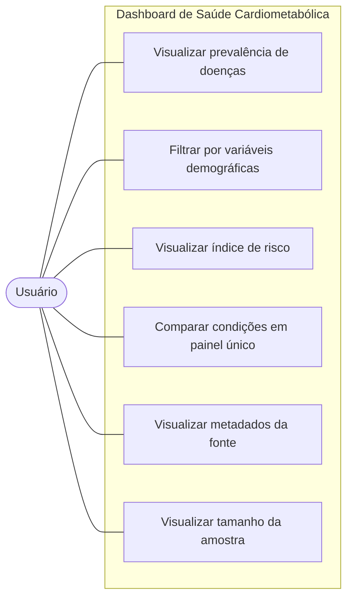

# Dashboard de Saúde Cardiometabólica

## Objetivo de Desenvolvimento Sustentável (ODS)

Este projeto está de acordo com **ODS 3 — Saúde e Bem-Estar**, que busca garantir
uma vida saudável e promover o bem-estar para todos, em todas as idades.

## Problema

Doenças crônicas não transmissíveis como hipertensão, diabetes, colesterol
alto e doenças cardiovasculares representam uma das principais causas de
morbimortalidade no Brasil, e sua prevalência está fortemente associada a
fatores demográficos e socioeconômicos, como idade, escolaridade e região do
país. No entanto, esses dados costumam estar disponíveis apenas em relatórios
estáticos e pouco acessíveis, dificultando a análise exploratória.

## Tipo de solução

**Dashboard de dados**, desenvolvido com a base de dados da **PNS 2019
(Pesquisa Nacional de Saúde, IBGE)**.

**Justificativa:** um dashboard permite explorar de forma interativa a
prevalência dessas condições de saúde, cruzando diferentes variáveis (faixa
etária, escolaridade, região) sem exigir conhecimento técnico em estatística
do usuário final. Diferente de um relatório estático, o dashboard possibilita
que gestores e pesquisadores testem diferentes recortes dos dados
dinamicamente, favorecendo a tomada de decisão baseada em evidências.

## Requisitos Funcionais

| Código | Descrição |
|--------|-----------|
| RF01 | Exibir prevalência de hipertensão por faixa etária, escolaridade e região |
| RF02 | Exibir prevalência de diabetes por faixa etária, escolaridade e região |
| RF03 | Exibir prevalência de colesterol alto por faixa etária, escolaridade e região |
| RF04 | Exibir prevalência de doenças cardiovasculares por faixa etária, escolaridade e região |
| RF05 | Exibir comparativo entre as quatro condições em um único painel |
| RF06 | Permitir filtrar os dados por faixa etária |
| RF07 | Permitir filtrar os dados por nível de escolaridade |
| RF08 | Permitir filtrar os dados por região/estado |
| RF09 | Permitir combinar múltiplos filtros simultaneamente |
| RF10 | Calcular e exibir um índice de risco cardiometabólico combinando as 4 condições |
| RF11 | Exibir número total de indivíduos analisados conforme os filtros aplicados |
| RF12 | Exibir gráficos comparativos entre grupos |
| RF13 | Carregar e processar os dados da PNS 2019 automaticamente ao iniciar a aplicação |
| RF14 | Exibir metadados sobre a fonte dos dados (PNS 2019, IBGE) |

## Requisitos Não Funcionais

| Código | Descrição |
|--------|-----------|
| RNF01 | A aplicação deve ser responsiva, funcionando bem em diferentes tamanhos de tela |
| RNF02 | O tempo de carregamento inicial dos dados não deve ultrapassar 5 segundos |
| RNF03 | A aplicação deve garantir o anonimato dos dados, sem exibir identificadores individuais |
| RNF04 | A interface deve utilizar linguagem clara e acessível |
| RNF05 | A aplicação deve ser desenvolvida em Python, utilizando Streamlit |
| RNF06 | O repositório deve conter documentação suficiente para rodar a aplicação localmente |

## Diagrama de Caso de Uso

